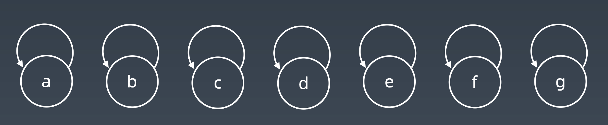
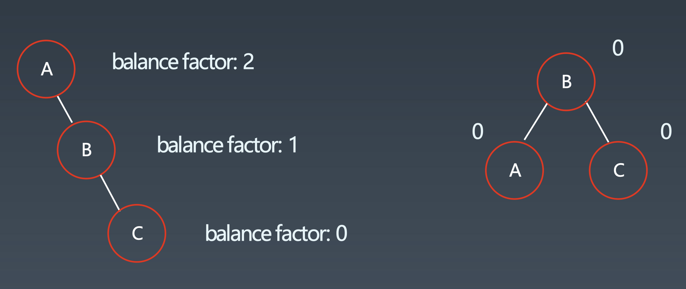

学习笔记

[TOC]

# 字典树 Trie

## 树Tree


## 基本结构

字典树，即`Trie`树，又称单词查找树或键树，是一种树形结构。典型应用是用于统计和排序大量的字符串（但不仅限于字符串），所以经常被搜索引擎系统用于文本词频统计。

它的优点是：最大限度地减少无谓的字符串比较，查询效率比哈希表高。


## 基本性质

1. 结点本身不存完整单词；

2. 从根结点到某一结点，路径上经过的字符连接起来，为该结点对应的字符串；

3. 每个结点的所有子结点路径代表的字符都不相同。

## 节点存储额外信息


## 节点内部的实现


## 核心思想

空间换时间，利用字符串的公共前缀来降低查询时间的开销以达到提高效率的目的。

## 代码模板

### python

```python
class Trie(object):
    def __init__(self):
        self.root = {}
        self.end_of_word = "#"

    def insert(self, word):
        node = self.root
        for char in word:
            node = node.setdefault(char, {})
        node[self.end_of_word] = self.end_of_word

    def search(self, word):
        node = self.root
        for char in word:
            if char not in node:
                return False
            node = node[char]
        return self.end_of_word in node

    def startsWith(self, prefix):
        node = self.root
        for char in prefix:
            if char not in node:
                return False
            node = node[char]
        return True
```

# 并查集 Disjoint Set

## 适用场景

- 组团配对问题
- Group or not

## 基本操作

- makeSet(s)：建立一个新的并查集，其中包含 s 个单元素集合。
- unionSet(x, y)：把元素 x 和元素 y 所在的集合合并，要求 x 和 y 所在的集合不相交，如果相交则不合并
- find(x)：找到元素 x 所在的集合的代表，该操作也可以用于判断两个元素是否位于同一个集合，只要将它们各自的代表比较一下就可以了。

### 初始化



### 查询合并


### 路径压缩


## 代码模板

### Java 实现

```java
class UnionFind {

    private int count = 0;
    private int[] parent;

    public UnionFind(int n) {
        count = n;
        parent = new int[n];
        for (int i = 0; i < n; i++) {
            parent[i] = i;
        }
    }

    public int find(int p) {
        while (p != parent[p]) {
            parent[p] = parent[parent[p]];
            p = parent[p];
        }
        return p;
    }

    public void union(int p, int q) {
        int rootP = find(p);
        int rootQ = find(q);
        if (rootP == rootQ){
            return;
        }
        parent[rootP] = rootQ;
        count--;
    }
}
```

### python 实现

```python
def init(p):
    # for i = 0 .. n: p[i] = i;
    p = [i for i in range(n)]

def union(self, p, i, j):
    p1 = self.parent(p, i)
    p2 = self.parent(p, j)
    p[p1] = p2

def parent(self, p, i):
    root = i
    while p[root] != root:
        root = p[root]

    while p[i] != i: # 路径压缩 ?
        x = i; i = p[i]; p[x] = root

    return root
```

# 剪枝

## 回溯法

回溯法采用试错的思想，它尝试分步的去解决一个问题。在分步解决问题的过程中，当它通过尝试发现现有的分步答案不能得到有效的正确的解答的时候，它将取消上一步甚至是上几步的计算，再通过其它的可能的分步解答再次尝试寻找问题的答案。

回溯法通常用最简单的递归方法来实现，在反复重复上述的步骤后可能出现两种情况：

- 找到一个可能存在的正确的答案
- 在尝试了所有可能的分步方法后宣告该问题没有答案

在最坏的情况下，回溯法会导致一次复杂度为指数时间的计算。

通过剪枝方法可以减少不必要的步骤。

# 双向 BFS

## Breadth First Search (BFS)


### Breadth-First Search Levels


## Two-ended BFS 双向BFS


# 启发式搜索 Heuristic Search (A*)

## 代码模板

### python

```python
def AstarSearch(graph, start, end):
    pq = collections.priority_queue() # 优先级 —> 估价函数
    pq.append([start])
    visited.add(start)

    while pq:
        node = pq.pop() # can we add more intelligence here ?
        visited.add(node)

        process(node)
        nodes = generate_related_nodes(node)
        unvisited = [node for node in nodes if node not in visited]
        pq.push(unvisited)
```

## 估价函数

启发式函数： h(n)，它用来评价哪些结点最有希望的是一个我们要找的结点，h(n) 会返回一个非负实数,也可以认为是从结点n的目标结点路径的估计成本。

启发式函数是一种告知搜索方向的方法。它提供了一种明智的方法来猜测哪个邻居结点会导向一个目标。

# 高级树

## AVL 树

1. 发明者 G. M. Adelson-Velsky 和 Evgenii Landis

2. Balance Factor（平衡因子）： 是它的左子树的高度减去它的右子树的高度（有时相反）。 balance factor = {-1, 0, 1}

3. 通过旋转操作来进行平衡（四种）

4. https://en.wikipedia.org/wiki/Self-balancing_binary_search_tree

### 记录左右子树高度


### 旋转操作


1. 左旋

2. 右旋

3. 左右旋

4. 右左旋

#### 子树形态：右右子树 —> 左旋



#### 子树形态：左左子树 —> 右旋


#### 子树形态：左右子树 —> 左右旋


#### 子树形态：右左子树 —> 右左旋


#### 带有子树的旋转


参考动画： https://zhuanlan.zhihu.com/p/63272157

### AVL 总结

1. 平衡二叉搜索树

2. 每个结点存 balance factor = {-1, 0, 1}

3. 四种旋转操作

不足：结点需要存储额外信息、且调整次数频繁

# 红黑树


红黑树是一种<font color=red>近似平衡</font>的二叉搜索树（Binary Search Tree），它能够确保任何一个结点的左右子树的<font color=red>高度差小于两倍</font>。具体来说，红黑树是满足如下条件的二叉搜索树：

• 每个结点要么是红色，要么是黑色

• 根结点是黑色

• 每个叶结点（NIL结点，空结点）是黑色的。

• 不能有相邻接的两个红色结点

• 从任一结点到其每个叶子的所有路径都包含相同数目的黑色结点。

## 关键特性

从根到叶子的最长的可能路径不多于最短的可能路径的两倍长。

## 与AVL树对比

- AVL trees provide <font color=red>faster lookups</font> than Red Black Trees because they are <font color=red>fmore strictly balanced</font>.
- Red Black Trees provide <font color=red>ffaster insertion and removal</font> operations than AVL trees as fewer rotations are done due to relatively relaxed balancing.
- AVL trees store balance <font color=red>factors or heights</font> with each node, thus requires storage for an integer per node whereas Red Black Tree requires only 1 bit of information per node.
- Red Black Trees are used in most of the <font color=red>flanguage libraries like map, multimap, multisetin C++</font> whereas AVL trees are used in <font color=red>databases</font> where faster retrievals are required.
