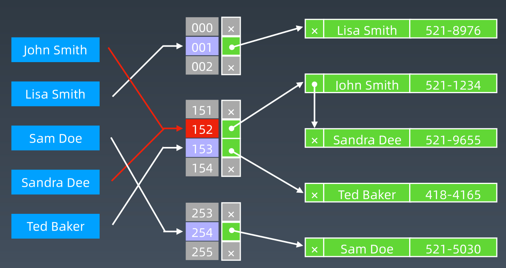
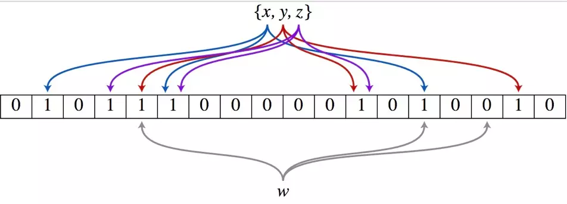
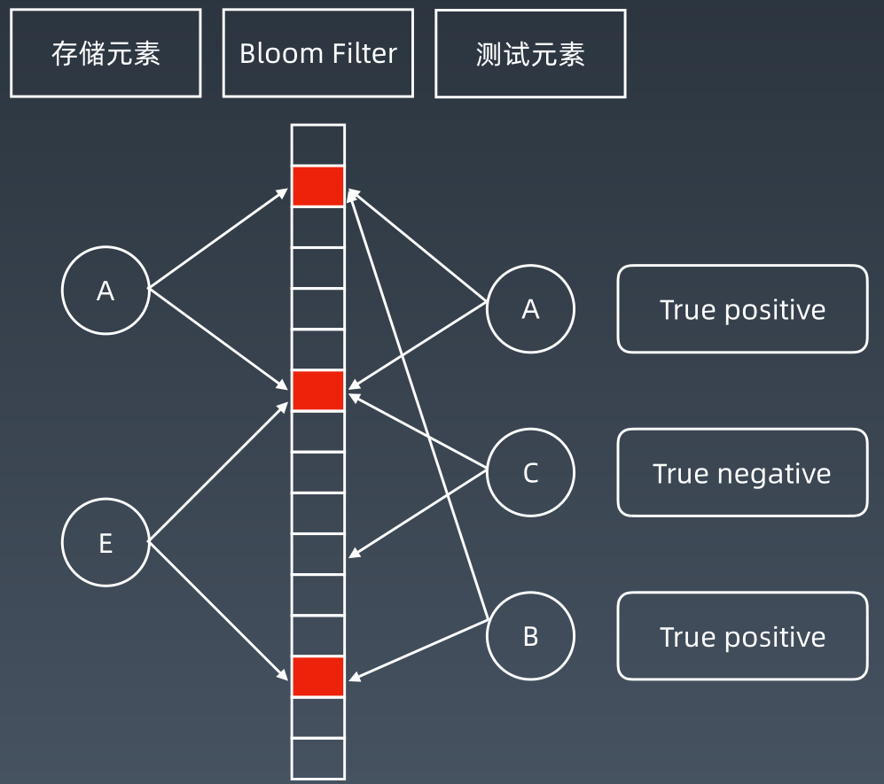
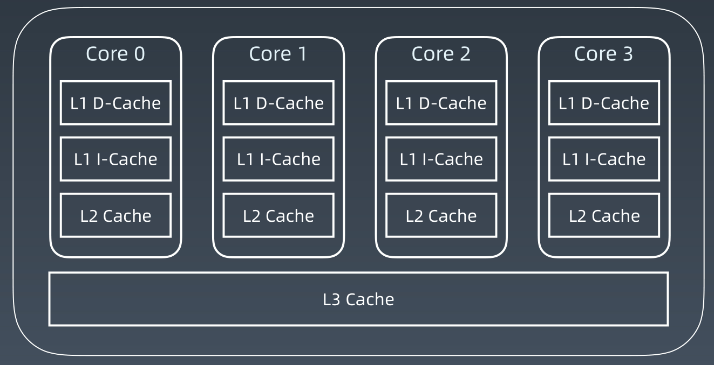
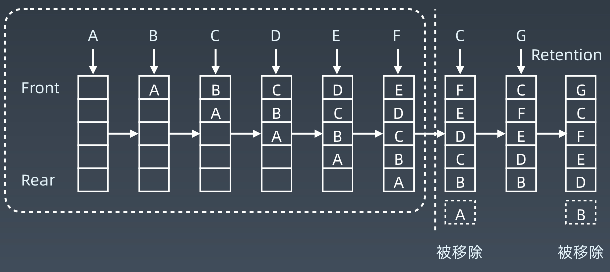
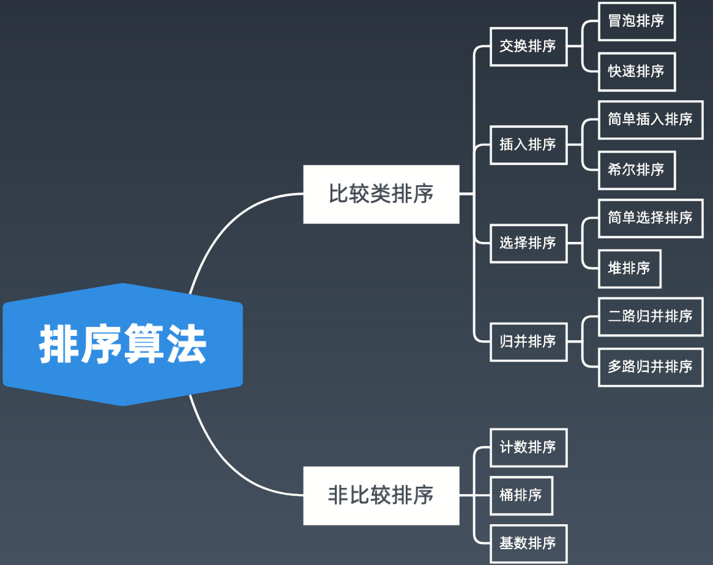

学习总结

[TOC]

# 位运算

## 知识点

### 位运算符

| 含义                         | 运算符   | 示例                                  |
| ---------------------------- | -------- | ------------------------------------- |
| 左移                         | <<       | 0011  =>  0110                        |
| 右移                         | &gt;&gt; | 0110  =>  0011                        |
| 按位或                       | \|       | 0011  <br/> ------  =>  1011<br/>1011 |
| 按位与                       | &        | 0011<br />-------  =>  0011<br />1011 |
| 按位取反                     | ~        | 0011  =>  1100                        |
| 按位异或（相同为零不同为一） | ^        | 0011<br />-------  =>  1000<br />1011 |

### XOR - 异或

异或：相同为 0，不同为 1。也可用“不进位加法”来理解。
异或操作的一些特点：

- x ^ 0 = x
- x ^ 1s = ~x // 注意 1s = ~0
- x ^ (~x) = 1s
- x ^ x = 0
- c = a ^ b => a ^ c = b, b ^ c = a // 交换两个数
- a ^ b ^ c = a ^ (b ^ c) = (a ^ b) ^ c // associative

### 指定位置的位运算

1. 将 x 最右边的 n 位清零：x & (~0 << n)
2. 获取 x 的第 n 位值（0 或者 1）： (x >> n) & 1
3. 获取 x 的第 n 位的幂值：x & (1 << n)
4. 仅将第 n 位置为 1：x | (1 << n)
5. 仅将第 n 位置为 0：x & (~ (1 << n))
6. 将 x 最高位至第 n 位（含）清零：x & ((1 << n) - 1)

### 位运算要点

#### 判断奇偶

>x % 2 == 1 —> (x & 1) == 1
>x % 2 == 0 —> (x & 1) == 0

#### x >> 1 —> x / 2

>x = x / 2; 等价于 x = x >> 1;
>
>mid = (left + right) / 2; 等价于 mid = (left + right) >> 1;

#### X = X & (X-1) 清零最低位的 1

#### X & -X => 得到最低位的 1

#### X & ~X => 0

## 代码模板

### python

```python
def totalNQueens(self, n):
    if n < 1: 
        return []
    self.count = 0
    self.DFS(n, 0, 0, 0, 0)
    return self.count
    
def DFS(self, n, row, cols, pie, na):
    # recursion terminator
    if row >= n:
        self.count += 1
        return
    
    bits = (~(cols | pie | na)) & ((1 << n) — 1) # 得到当前所有的空位

    while bits:
        p = bits & —bits # 取到最低位的1
        bits = bits & (bits — 1) # 表示在p位置上放入皇后
        self.DFS(n, row + 1, cols | p, (pie | p) << 1, (na | p) >> 1)
        # 不需要revert cols, pie, na 的状态
```

### Java

```java
class Solution {
    private int size;
    private int count;
    private void solve(int row, int ld, int rd) {
        if (row == size) {
            count++;
            return;
        }
        
        int pos = size & (~(row | ld | rd));
        
        while (pos != 0) {
            int p = pos & (-pos);
            pos -= p; // pos &= pos - 1;
            solve(row | p, (ld | p) << 1, (rd | p) >> 1);
        }
    }
    
    public int totalNQueens(int n) {
        count = 0;
        size = (1 << n) - 1;
        solve(0, 0, 0);
        return count;
    }
}
```

# 布隆过滤器（Bloom Filter）

## HashTable + 拉链存储重复元素



## Bloom Filter vs Hash Table

一个很长的二进制向量和一系列随机映射函数。布隆过滤器可以用于检索一个元素是否在一个集合中。

**优点：**是空间效率和查询时间都远远超过一般的算法，
**缺点：**是有一定的误识别率和删除困难。

## 布隆过滤器示意图





## 使用案例

1. 比特币网络
2. 分布式系统（Map-Reduce） — Hadoop、search engine
3. Redis 缓存
4. 垃圾邮件、评论等的过滤

## 代码模板

### python

```python
from bitarray import bitarray
import mmh3

class BloomFilter:
    def __init__(self, size, hash_num):
        self.size = size
        self.hash_num = hash_num
        self.bit_array = bitarray(size)
        self.bit_array.setall(0)
        
    def add(self, s):
        for seed in range(self.hash_num):
            result = mmh3.hash(s, seed) % self.size
            self.bit_array[result] = 1
            
    def lookup(self, s):
        for seed in range(self.hash_num):
            result = mmh3.hash(s, seed) % self.size
            if self.bit_array[result] == 0:
            	return "Nope"            
        return "Probably"
    
bf = BloomFilter(500000, 7)
bf.add("dantezhao")
print (bf.lookup("dantezhao"))
print (bf.lookup("yyj"))
```

### Java

```java
package com.github.lovasoa.bloomfilter;

import java.util.BitSet;
import java.util.Random;
import java.util.Iterator;

public class BloomFilter implements Cloneable {
  private BitSet hashes;
  private RandomInRange prng;
  private int k; // Number of hash functions
  private static final double LN2 = 0.6931471805599453; // ln(2)

  /**
   * Create a new bloom filter.
   * @param n Expected number of elements
   * @param m Desired size of the container in bits
   **/
  public BloomFilter(int n, int m) {
    k = (int) Math.round(LN2 * m / n);
    if (k <= 0) k = 1;
    this.hashes = new BitSet(m);
    this.prng = new RandomInRange(m, k);
  }

  /**
   * Create a bloom filter of 1Mib.
   * @param n Expected number of elements
   **/
  public BloomFilter(int n) {
    this(n, 1024*1024*8);
  }

  /**
  * Add an element to the container
  **/
  public void add(Object o) {
    prng.init(o);
    for (RandomInRange r : prng) hashes.set(r.value);
  }
  /** 
  * If the element is in the container, returns true.
  * If the element is not in the container, returns true with a probability ≈ e^(-ln(2)² * m/n), otherwise false.
  * So, when m is large enough, the return value can be interpreted as:
  *    - true  : the element is probably in the container
  *    - false : the element is definitely not in the container
  **/
  public boolean contains(Object o) {
    prng.init(o);
    for (RandomInRange r : prng)
      if (!hashes.get(r.value))
        return false;
    return true;
  }

  /**
   * Removes all of the elements from this filter.
   **/
  public void clear() {
    hashes.clear();
  }

  /**
   * Create a copy of the current filter
   **/
  public BloomFilter clone() throws CloneNotSupportedException {
    return (BloomFilter) super.clone();
  }

  /**
   * Generate a unique hash representing the filter
   **/
  public int hashCode() {
    return hashes.hashCode() ^ k;
  }

  /**
   * Test if the filters have equal bitsets.
   * WARNING: two filters may contain the same elements, but not be equal
   * (if the filters have different size for example).
   */
  public boolean equals(BloomFilter other) {
    return this.hashes.equals(other.hashes) && this.k == other.k;
  }

  /**
   * Merge another bloom filter into the current one.
   * After this operation, the current bloom filter contains all elements in
   * other.
   **/
  public void merge(BloomFilter other) {
    if (other.k != this.k || other.hashes.size() != this.hashes.size()) {
      throw new IllegalArgumentException("Incompatible bloom filters");
    }
    this.hashes.or(other.hashes);
  }

  private class RandomInRange
      implements Iterable<RandomInRange>, Iterator<RandomInRange> {

    private Random prng;
    private int max; // Maximum value returned + 1
    private int count; // Number of random elements to generate
    private int i = 0; // Number of elements generated
    public int value; // The current value

    RandomInRange(int maximum, int k) {
      max = maximum;
      count = k;
      prng = new Random();
    }
    public void init(Object o) {
      prng.setSeed(o.hashCode());
    }
    public Iterator<RandomInRange> iterator() {
      i = 0;
      return this;
    }
    public RandomInRange next() {
      i++;
      value = prng.nextInt() % max;
      if (value<0) value = -value;
      return this;
    }
    public boolean hasNext() {
      return i < count;
    }
    public void remove() {
      throw new UnsupportedOperationException();
    }
  }
}
```


# LRU Cache

## Cache 缓存

### CPU Socket



 ## 知识点

- 两个要素： 大小 、替换策略

- Hash Table + Double LinkedList

- O(1) 查询

  O(1) 修改、更新

## LRU cache 工作示例



## 替换策略

- LFU - least frequently used
- LRU - least recently used

## 替换算法总览

https://en.wikipedia.org/wiki/Cache_replacement_policies

## 代码模板

### Python

```python
class LRUCache(object):
    def __init__(self, capacity):
        self.dic = collections.OrderedDict()
        self.remain = capacity
        
    def get(self, key):
        if key not in self.dic:
        	return -1
        v = self.dic.pop(key)
        self.dic[key] = v # key as the newest one
        return v
    
    def put(self, key, value):
        if key in self.dic:
        	self.dic.pop(key)
        else:
            if self.remain > 0:
                self.remain -= 1
            else: # self.dic is full
                self.dic.popitem(last=False)
        self.dic[key] = value
```

### Java

```java
public class LRUCache {
    private Map<Integer, Integer> map;
    public LRUCache(int capacity) {
    	map = new LinkedCappedHashMap<>(capacity);
    }
    public int get(int key) {
        if(!map.containsKey(key)) { return -1; }
        return map.get(key);
    }
    public void put(int key, int value) {
    	map.put(key,value);
    }
    
    private static class LinkedCappedHashMap<K,V> extends LinkedHashMap<K,V> {
        int maximumCapacity;
        
        LinkedCappedHashMap(int maximumCapacity) {
            super(16, 0.75f, true);
            this.maximumCapacity = maximumCapacity;
        }
        
        protected boolean removeEldestEntry(Map.Entry eldest) {
        	return size() > maximumCapacity;
        }
    }
}
```

# 排序

## 排序算法




### 比较类

通过比较来决定元素间的相对次序，由于其时间复杂度不能突破O(nlogn)，因此也称为非线性时间比较类排序。

### 非比较类

不通过比较来决定元素间的相对次序，它可以突破基于比较排序的时间下界，以线性时间运行，因此也称为线性时间非比较类排序。

## 初级排序 - O(n^2)

1. 选择排序（Selection Sort）
每次找最小值，然后放到待排序数组的起始位置。
2. 插入排序（Insertion Sort）
从前到后逐步构建有序序列；对于未排序数据，在已排序序列中从后向前扫描，找到相应位置并插入。
3. 冒泡排序（Bubble Sort）
  嵌套循环，每次查看相邻的元素如果逆序，则交换

## 高级排序 - O(N*LogN)

### 快速排序（Quick Sort）

数组取标杆 pivot，将小元素放 pivot左边，大元素放右侧，然后依次对右边和右边的子数组继续快排；以达到整个序列有序。

#### 代码模板

##### Java

```java
public static void quickSort(int[] array, int begin, int end) {
    if (end <= begin) return;
    int pivot = partition(array, begin, end);
    quickSort(array, begin, pivot - 1);
    quickSort(array, pivot + 1, end);
}
static int partition(int[] a, int begin, int end) {
    // pivot: 标杆位置，counter: 小于pivot的元素的个数
    int pivot = end, counter = begin;
    for (int i = begin; i < end; i++) {
        if (a[i] < a[pivot]) {
            int temp = a[counter]; a[counter] = a[i]; a[i] = temp;
            counter++;
        }
    }
    int temp = a[pivot]; a[pivot] = a[counter]; a[counter] = temp;
    return counter;
}
```

调用方式： quickSort(a, 0, a.length - 1)

### 归并排序（Merge Sort）— 分治

1. 把长度为n的输入序列分成两个长度为n/2的子序列；
2. 对这两个子序列分别采用归并排序；
3. 将两个排序好的子序列合并成一个最终的排序序列。

#### 代码模板

##### Java

```java
public static void mergeSort(int[] array, int left, int right) {
    if (right <= left) return;
    int mid = (left + right) >> 1; // (left + right) / 2
    mergeSort(array, left, mid);
    mergeSort(array, mid + 1, right);
    merge(array, left, mid, right);
}

public static void merge(int[] arr, int left, int mid, int right) {
    
    int[] temp = new int[right - left + 1]; // 中间数组
    int i = left, j = mid + 1, k = 0;
    
    while (i <= mid && j <= right) {
    	temp[k++] = arr[i] <= arr[j] ? arr[i++] : arr[j++];
    }
    
    while (i <= mid) temp[k++] = arr[i++];
    while (j <= right) temp[k++] = arr[j++];
    
    for (int p = 0; p < temp.length; p++) {
    	arr[left + p] = temp[p];
    }
    // 也可以用 System.arraycopy(a, start1, b, start2, length)
}
```

#### 归并与快排的比较

**归并** 和 **快排** 具有相似性，但步骤顺序相反
**归并**：先排序左右子数组，然后合并两个有序子数组
**快排**：先调配出左右子数组，然后对于左右子数组进行排序

### 堆排序（Heap Sort）

堆插入 O(logN)，取最大/小值 O(1)

1. 数组元素依次建立小顶堆
2. 依次取堆顶元素，并删除

### 特殊排序 - O(n)

#### 计数排序（Counting Sort）

计数排序要求输入的数据必须是有确定范围的整数。将输入的数据值转化为键存储在额外开辟的数组空间中；然后依次把计数大于 1 的填充回原数组

#### 桶排序（Bucket Sort）

桶排序 (Bucket sort)的工作的原理：假设输入数据服从均匀分布，将数据分到有限数量的桶里，每个桶再分别排序（有可能再使用别的排序算法或是以递归方式继续使用桶排序进行排）。

#### 基数排序（Radix Sort）

基数排序是按照低位先排序，然后收集；再按照高位排序，然后再收集；依次类推，直到最高位。有时候有些属性是有优先级顺序的，先按低优先级排序，再按高优先级排序。

## 排序动画演示

https://www.cnblogs.com/onepixel/p/7674659.html

https://www.bilibili.com/video/av25136272

https://www.bilibili.com/video/av63851336